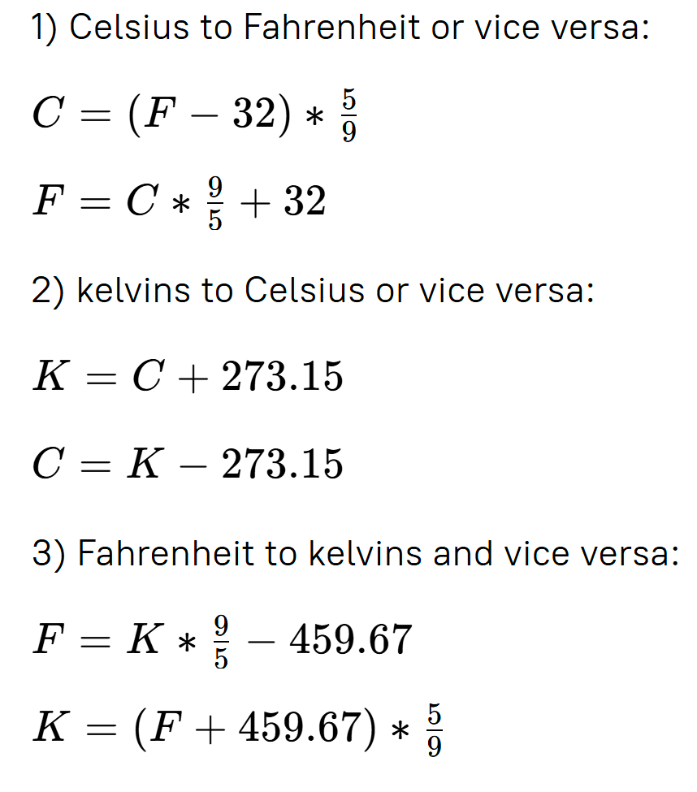

# About

When you travel, everything changes: people, languages, time zones, and even units. It may be difficult to read the temperature in Fahrenheit when you’ve always used Celsius, or to measure yourself in kilos if you’ve only used pounds. It’s no easy matter, though a nice unit converter could certainly help! In this project, you will write a converter that handles distance, weight, and temperature units – all the traveller’s essentials.

[Link to the project](https://hyperskill.org/projects/70)

# Stage 1/5
## Description
Humans use a whole variety of units of measurement depending on the purpose or the country. When you need to convert something from one unit to another, it is not very convenient to calculate it in your head. Let's create a really useful application that will perform these tedious calculations for us!

In this stage, you will take your first step in creating a program that converts length, weight, and temperature from one common unit of measurement to another. To begin with, let's simply print some exemplary conversions.

## Objectives
Print exactly the same lines as shown in the example below.

In this stage there is no need for conversions. Simply print the string(s) exactly as written bellow.

## Example
```
145 centimeters is 1.45 meters
2 miles is 3.2187 kilometers
5.5 inches is 139.7 millimeters
12 degrees Celsius is 53.6 degrees Fahrenheit
3 pounds is 1.360776 kilograms
```

# Stage 2/5

## Description
The examples you've printed are great, but they are not really helpful. Let's take a step further and create a program that converts kilometers to meters. Remember that one kilometer equals exactly 1000 meters.

The program should prompt the user to enter the number of kilometers with the following message: "Enter a number and a measure: ". The user should input a number and a unit of measurement, for example, 2 km or 2 kilometers. Note that the units of measurement should be case insensitive, so "km", "KM", and "kM" should work just as fine as "km".

The program should then output the equivalent of x kilometers in meters in the following format: x kilometers is y meters.

If the name of the unit of measurement is entered incorrectly, the program should display: Wrong input.

## Objectives
1. The program should convert the given number of kilometers to meters.
2. The user can input "km", "kilometer" or "kilometers".
3. The program should ask the user for input only once, not infinitely.
4. If the value is 1, the name of the unit must be singular, otherwise, plural: "1 kilometer" but "2 kilometers".
5. It is guaranteed that the number of kilometers is an integer.
6. If the name of the unit of measurement is entered incorrectly, the program should display: Wrong input.

## Examples
Example 1:
```
Enter a number and a measure: 25 km
25 kilometers is 25000 meters
```
Example 2:
```
Enter a number and a measure: 1 kiLOmeter
1 kilometer is 1000 meters
```
Example 3:
```
Enter a number and a measure: 5 miles
Wrong input
```

# Stage 3/5

## Description
There are many different units of length: feet, inches, yards, centimeters, and others. In this stage, the program should convert these common units of length to meters.

The user should input a number and a unit of measurement, for example, 2 km or 2 kilometers. Note that the units of measurement should be case insensitive, so "Meters", "METERS", and "mEtErS" should work just as fine as "meters".

Your program should support the following units:

- Meters: the user can input "m", "meter", or "meters".

- Kilometers: the user can input "km", "kilometer", or "kilometers".

- Centimeters: the user can input "cm", "centimeter", or "centimeters".

- Millimeters: the user can input "mm", "millimeter", or "millimeters".

- Miles: the user can input "mi", "mile", or "miles".

- Yards: the user can input "yd", "yard", or "yards".

- Feet: the user can input "ft", "foot", or "feet".

- Inches: the user can input "in", "inch", or "inches".

For these units, use the following conversion rates:

- One meter equals 1 meter.

- One kilometer equals 1000 meters.

- One centimeter equals 0.01 meters.

- One millimeter equals 0.001 meters.

- One mile equals 1609.35 meters.

- One yard equals 0.9144 meters.

- One foot equals 0.3048 meters.

- One inch equals 0.0254 meters.
  
The user can enter the wrong unit of measure. In this case, your program should print: Wrong input. Unknown unit $inputUnit.

## Objectives
Your program should be able to convert all the supported units to meters.
The output should contain the full names of the units.
If the value is 1.0, the name of the unit must be singular, otherwise, plural, for example, "1.0 meter" but "1.1 meters".
The program should ask the user for input only once, not infinitely.

## Examples
Example 1:
```
Enter a number and a measure of length: 1 m
1.0 meter is 1.0 meter
```
Example 2:
```
Enter a number and a measure of length: 1000 millimeters
1000.0 millimeters is 1.0 meter
```
Example 3:
```
Enter a number and a measure of length: 12.9 feet
12.9 feet is 3.9319200000000003 meters
```
Example 4:
```
Enter a number and a measure of length: 1 miles
1.0 mile is 1609.35 meters
```

# Stage 4/5

## Description
Your program is now pretty helpful when it comes to converting length units. However, there's still room for improvement: let's make the program able to convert not just to meters but to any units of measurement.

Speaking of "any units of measurement"... What if you are cooking and the recipe uses units of weight that are unfamiliar to you? Let's add more units of measurement to our converter now!

In this stage, your program should be able to convert values in any supported units of length or weight to any other appropriate units. The user should input the number, the source unit of measurement, a transition word (for example, "in" or "to", but it can be any random word), and finally, the target unit. This scheme looks like this: x kg to mg, y pound in kg.

Your program should be able to work with the following additional units:

- Grams: the user can input "g", "gram", or "grams".

- Kilograms: the user can input "kg", "kilogram", or "kilograms".

- Milligrams: the user can input "mg", "milligram", or "milligrams".

- Pounds: the user can input "lb", "pound", or "pounds".

- Ounces: the user can input "oz", "ounce", or "ounces".

Hard-coding all these conversion rates is possible but not very efficient. A smarter way would be to convert the input value to one intermediate "hub" unit and only then convert that intermediate value to the target value. The intermediate units could be meters for length and grams for weight. To convert weight units to grams, use the following rates:

- One gram equals 1 gram.

- One kilogram equals 1000 grams.

- One milligram equals 0.001 grams.

- One pound equals 453.592 grams.

- One ounce equals 28.3495 grams.

- For your convenience, use a break line after each unit conversion.

In this stage, your program should also be able to handle errors. If the user attempts to perform an impossible conversion, for example, meters to kilograms, the program should output an appropriate error message: Conversion from meters to kilograms is impossible. If the program cannot recognize one of the units or both, output a message Conversion from ??? to kilograms is impossible where ??? stands for the unknown unit.

Finally, since we have all these new units, let's make our program run until the user decides to exit the converter.

## Objectives

1. Your program should be able to convert values in any units of length or weight to any other appropriate units.

2. The user input should be case insensitive.

3. The output should contain the full names of target units.

4. f the value is 1.0, the name of the unit must be singular, otherwise, plural, for example, "1.0 kilogram" but "1.1 kilograms".

5. After each unit conversion, use a break line.

6. Your program should be able to handle input errors. In the error message, both measurement types should be written in plural, not singular.

7. The program should keep processing user input until the user enters exit.

## Examples
Example 1:
```
Enter what you want to convert (or exit): 1 kg to ounces
1.0 kilogram is 35.27399072294044 ounces

Enter what you want to convert (or exit): 2 meters in yards
2.0 meters is 2.1872265966754156 yards

Enter what you want to convert (or exit): 1 pound in kg
1.0 pound is 0.453592 kilograms

Enter what you want to convert (or exit): exit
```
Example 2:
```
Enter what you want to convert (or exit): 1 oz to g
1.0 ounce is 28.3495 grams

Enter what you want to convert (or exit): 100 cm in meters
100.0 centimeters is 1.0 meter

Enter what you want to convert (or exit): 23.34 feet to in
23.34 feet is 280.08 inches

Enter what you want to convert (or exit): exit
```
Example 3:
```
Enter what you want to convert (or exit): 1 kn to feet
Conversion from ??? to feet is impossible

Enter what you want to convert (or exit): 3 grams to meters
Conversion from grams to meters is impossible

Enter what you want to convert (or exit): exit
```
Example 4:
```
Enter what you want to convert (or exit): 1 PouNd to feet
Conversion from pounds to feet is impossible

Enter what you want to convert (or exit): 100 CM in KM
100 centimeters is 0,001 kilometers

Enter what you want to convert (or exit): exit
```

# Stage 5/5

## Description

Our converter is really functional now, but there's still one thing missing: it can't work with temperature units. Let's extend the program by adding three units of temperature.

The main units of temperature used today are degrees Celsius (C), degrees Fahrenheit (F), and kelvins (K). The program should allow the following notations:

- For degrees Celsius, the user can input "degree Celsius", "degrees Celsius", "celsius", "dc", or "c".

- For degrees Fahrenheit, the user can input "degree Fahrenheit", "degrees Fahrenheit", "fahrenheit", "df", or "f".

- For kelvins, the user can input "kelvin", "kelvins", or "k".

Note that converting units of temperature is different from working with length or weight. The problem is that 0 kelvin is not equal to 0 degrees Celsius or 0 degrees Fahrenheit, and neither is 0 degrees Celsius equal to 0 degrees Fahrenheit. Negative values are also possible, and you should use the appropriate singular or plural form depending on the values you're dealing with. Therefore, our conversion process will differ.

Let's consider the formulae for converting one unit of temperature to another.




Try to rewrite your program using enums. The problem with representing measurement units as strings is that strings may take longer to process, especially since each unit has at least three different accepted string notations (such as “m”, “meter”, and “meters”).
If you represent each unit by a special enum value, your code becomes cleaner and more readable. Since comparing enum values is much faster than comparing strings, your code is also processed faster.

We want to make our users' lives easier, so, ensure to handle all edge cases. For example, if the user wants to convert weight or length from one unit to another and inputs a negative amount, print Weight shouldn't be negative or Length shouldn't be negative, respectively.

If a query is invalid or malformed, we should also handle this. Try to parse the following parts:
```
<number> +
<(unit name) or (degree + unit name) or (degrees + unit name)> +
<random word like "to" or "in"> +
<(unit name) or (degree + unit name) or (degrees + unit name)>
```
If there is an error, output Parse error.

## Objectives
1. Rewrite your program using enums.

2. Your program should be able to convert values from any unit of length, weight, or temperature to any other appropriate unit.

3. The user input remains case-insensitive.

4. Your program should be able to handle all the possible edge cases. In the error message, both measurement types should be written in the plural.

5. After each unit conversion, use a break line.

6. The program should keep processing user input until they enter exit.

## Examples
Example 1:
```
Enter what you want to convert (or exit): 1 degree Celsius to kelvins
1.0 degree Celsius is 274.15 kelvins

Enter what you want to convert (or exit): -272.15 dc to K
-272.15 degrees Celsius is 1.0 kelvin

Enter what you want to convert (or exit): 1 kn to feet
Conversion from ??? to feet is impossible

Enter what you want to convert (or exit): 1 km to feet
1.0 kilometer is 3280.839895013123 feet

Enter what you want to convert (or exit): 3 pount to ounces
Conversion from ??? to ounces is impossible

Enter what you want to convert (or exit): 3 pound to ounces
3.0 pounds is 47.99999999999999 ounces

Enter what you want to convert (or exit): 3 kelvins to grams
Conversion from kelvins to grams is impossible

Enter what you want to convert (or exit): exit
```
Example 2:
```
Enter what you want to convert (or exit): 1 F in K
1.0 degree Fahrenheit is 255.92777777777778 kelvins

Enter what you want to convert (or exit): 1 K in F
1.0 kelvin is -457.87 degrees Fahrenheit

Enter what you want to convert (or exit): 1 C in K
1.0 degree Celsius is 274.15 kelvins

Enter what you want to convert (or exit): 1 K in C
1.0 kelvin is -272.15 degrees Celsius

Enter what you want to convert (or exit): 1 F in C
1.0 degree Fahrenheit is -17.22222222222222 degrees Celsius

Enter what you want to convert (or exit): 1 C in F
1.0 degree Celsius is 33.8 degrees Fahrenheit

Enter what you want to convert (or exit): one boa in parrots
Parse error

Enter what you want to convert (or exit): please convert distance to the Moon to steps
Parse error

Enter what you want to convert (or exit): many things to improve!
Parse error

Enter what you want to convert (or exit): exit
```